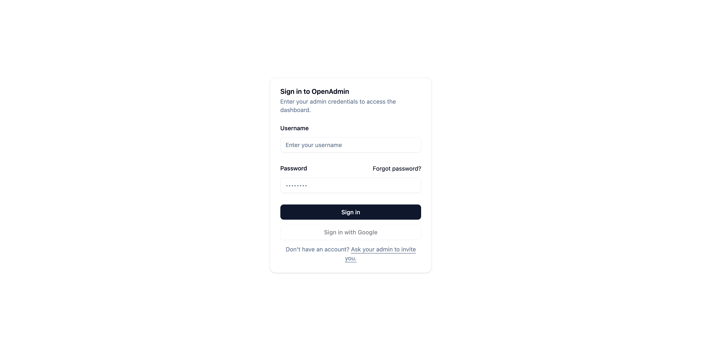
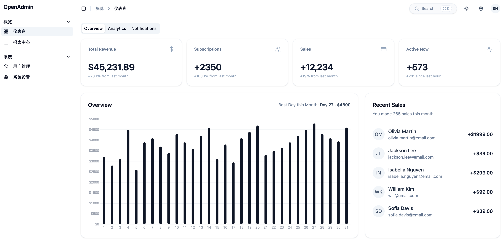

# simple-shadcn-vue-admin

一个极简、现代化的后台管理系统模板，基于 **Vue 3 + Vite** 构建，使用 **shadcn-vue + TailwindCSS** 打造统一且可扩展的 UI。  
内置 **登录体系、Token 管理、角色/路由权限控制** 等能力，适合作为后台类项目的基础骨架。

---

## 🖼️ 项目预览（Screenshots）

### 🔐 Login Page


### 📊 Dashboard Page


---

## 📌 项目简介（中文）

这是一个极简、现代化的后台管理系统模板，基于 **Vue 3 + Vite** 构建，使用 **shadcn-vue 与 TailwindCSS** 打造统一且可扩展的 UI 体系。  
项目内置 **登录、Token 管理、角色/路由权限控制** 等基础能力，可作为后台类项目的起点工程，帮助快速搭建管理端应用。

### ✨ 主要特性

- **现代技术栈**：Vue 3 + Vite，极速开发体验与构建速度
- **一致的 UI 风格**：基于 shadcn-vue 的可复用组件体系
- **权限系统开箱即用**：包含登录流程、Token 管理、角色/路由权限守卫
- **高度可扩展**：清晰的 router/state/api 分层，可轻松拓展模块
- **开发者友好**：附带示例页面（Dashboard、权限演示）便于理解项目结构

---

## 📌 Project Description (English)

A minimal and modern admin dashboard template built with **Vue 3 + Vite**, styled with **shadcn-vue** and **TailwindCSS**.  
It includes a complete authentication system with token handling and role/route-based authorization.  
Designed as a lightweight and extensible foundation for building admin dashboards and internal management tools.

### ✨ Key Features

- **Modern Stack**: Vue 3 + Vite for fast and smooth development
- **Consistent UI System**: Reusable components powered by shadcn-vue + TailwindCSS
- **Auth & Permissions Ready**: Login flow, token storage, and role-based route guards included
- **Highly Extensible**: Clear separation of router, state, and API layers
- **Developer-Friendly**: Example pages (dashboard, permission demos) included for quick onboarding

---

## 📦 安装与启动（Setup）

```bash
pnpm install
pnpm dev
